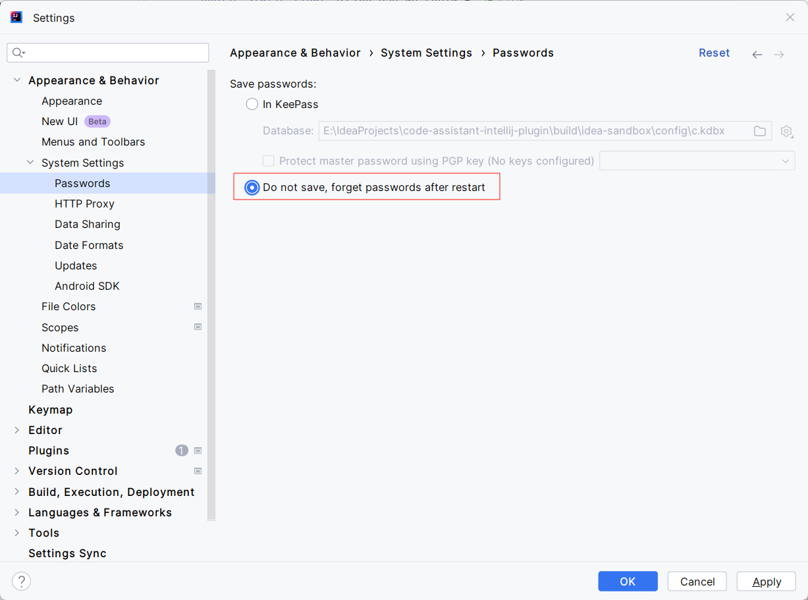
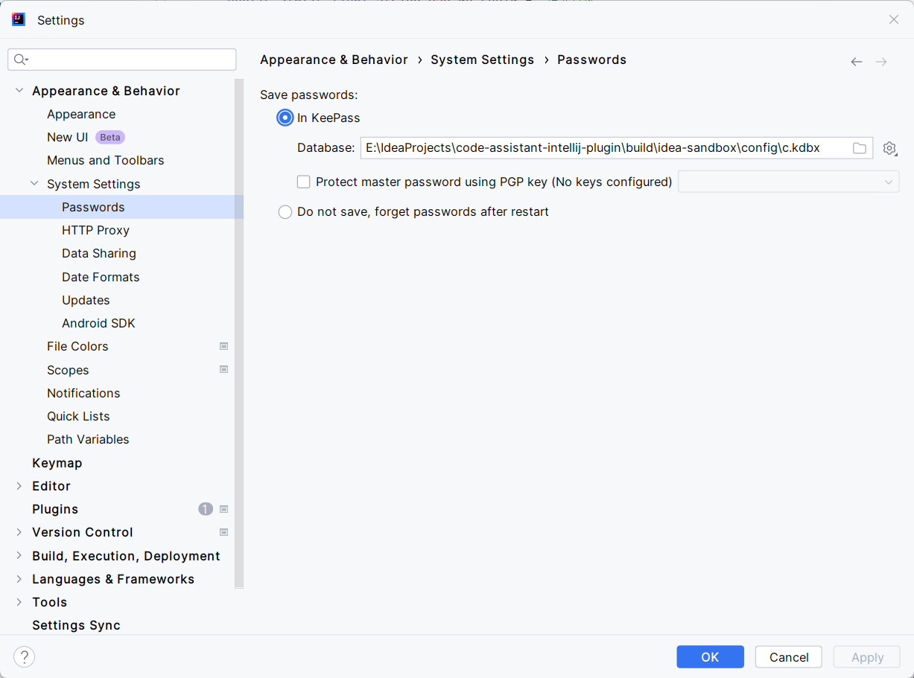
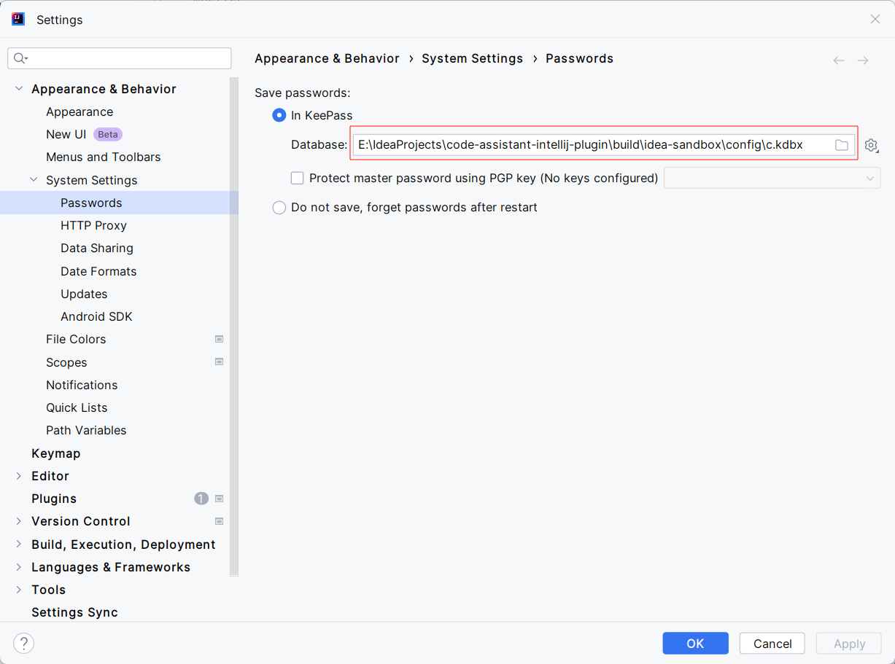

## 问题记录

#### 1. 设置好了密码，但 IDEA 重启后，密码并未保存

> File -> Appearance & Behavior -> System Settings -> Passwords

**原因**：IDEA 设置为不保存密码，重启后忘记密码

**解决**：IDEA 设置为保存密码，将密码保存到文件中

#### 2. 修改保存密码配置，报错：CannotSaveSettings:Internal error:java.io.EOFException

**原因**：未知（猜想是配置文件损坏）

**解决**：删除对应配置文件，重新保存配置

